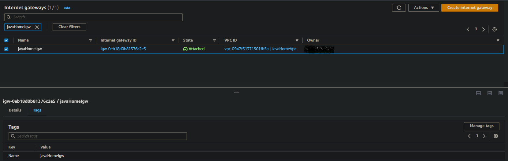
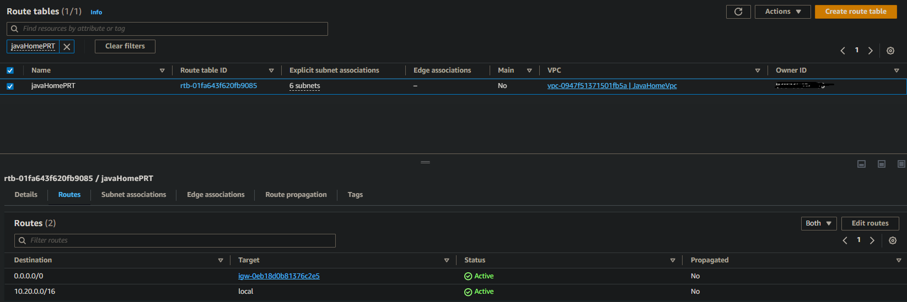
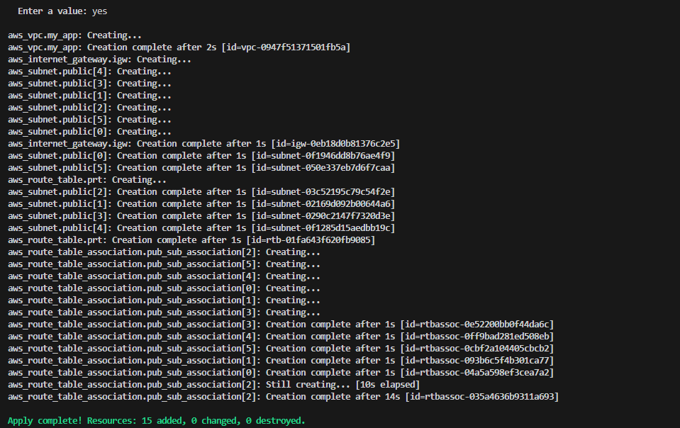
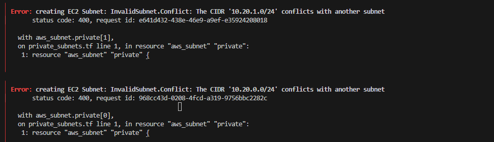
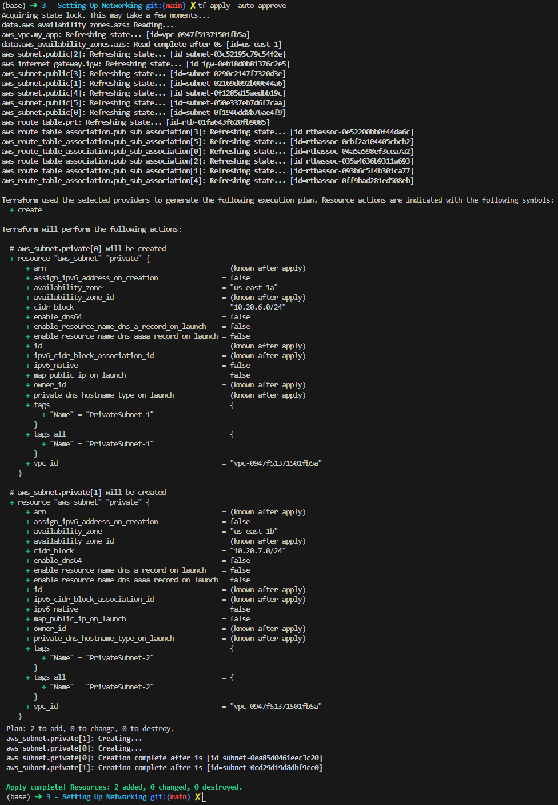
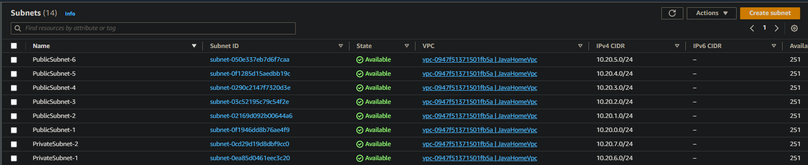
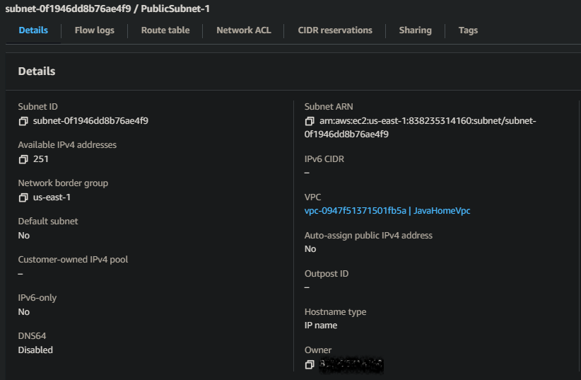
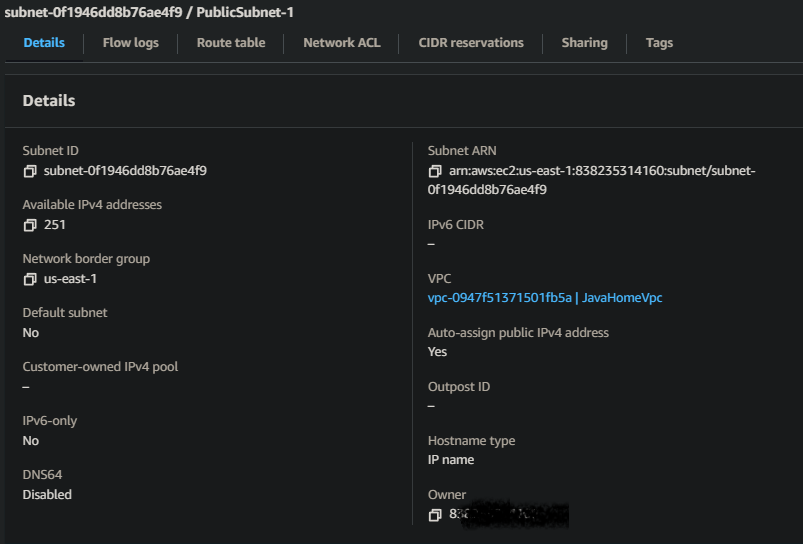

# A - Setting Up Networking For Our Applications
The ``${var.example}`` syntax is for including the result of an expression into a larger string. It is part of Terraform's string template syntax. For example, you might write ``${var.example}-foo`` to produce a string that consists of the value of ``var.example`` followed by the literal suffix ``-foo``.

**If you need only the value of the variable in isolation, without concatenating it with any other string values, there is no reason to use that interpolation syntax**; ``var.example`` and ``${var.example}`` are exactly equivalent.

For simple situations that Terraform can understand via basic syntactic analysis, terraform fmt will replace a redundant expression like ``${var.example}`` with its simpler equivalent ``var.example``. That tool encodes various idiomatic style conventions like this, and so 
> **it can be useful to apply the result of that tool (either directly by running it, or via its integration into plugins for editors like Visual Studio Code) to see if it makes an adjustment that would make your configuration style consistent with the usual idiomatic style.**
## A.1 - Create Public Subnet
For High Availability we need multiple subnets spanning multiples availability zone. For making those subnets public, we have to create ``internet gateways (IGW)`` and configure them through ``route table``.

* ````sh cidr_block = "${var.vpc_cidr}" ````: Returns the variable ``vpc_cidr`` define in ``variables.tf`` file.

* Variable define in ``dev.tfvars`` file are variable that is use in command line and those variables overwrite the one define in different file.

````sh
resource "aws_subnet" "public" {                          # Define resource with logical type and logical name
    count ="${length(local.az_names)}"                    # az_names is the list of the names of different az in the 
                                                          # region we work in.
    vpc_id = "${aws_vpc.my_app.id}"                       # Retrieve the Id of each VPC created
    cidr_block = cidrsubnet(var.vpc_cidr,8, count.index)  # Given a cidr_block, cidrsubnet will add 8 to a mask and 
                                                          # return one by one.
    availability_zone = "${local.az_names[count.index]}"  # count.index is to pick one by one element in a list starting at 0
    tags = {
     Name = "PublicSubnet-${count.index +1}"              # Here we will have for tags PublicSubnet-1, PublicSubnet-2, etc...
   }
}


````
### A.1.1 - Public subnet - Data Source CIDR Subnet

* [Terraform Data Sources – How They Are Utilized](https://spacelift.io/blog/terraform-data-sources-how-they-are-utilised)

* [Managing AWS Security Groups Through Terraform](https://spacelift.io/blog/terraform-security-group)


``Data sources`` help us **import some informations (metadata) with is define outside terraform configurations**

We'll use ``Data sources`` to fetch ``Availability zone`` from AWS account.

````sh
# Decare the data source
data "aws_availability_zones" "available" {
    state = "available"
}
````
This return all ``availability zone`` based on the region we're provisioning ressource.

To return all recent AWS AMI id from recent AWS, you can use 

````sh
data "axs_ami" "example" {
  most_recent = true
  owners      = ["self"]
  tags = {
    Name   = "app-server"
    Tested = true
  }
}

````

When this Terraform configuration with appropriate provider settings is initialized and enabled, **Terraform reads the information from AWS and makes it available** in the ``data.aws_availability_zone.available`` variable.

### A.1.1 - Public subnet - Internet Gateway (IGW)
* [IGW - Resource](https://registry.terraform.io/providers/hashicorp/aws/latest/docs/resources/internet_gateway)
* [IGW - Data sources](https://registry.terraform.io/providers/hashicorp/aws/latest/docs/data-sources/internet_gateway)

````sh
resource "aws_internet_gateway" "igw" {
  vpc_id = aws_vpc.my_app.id

  tags = {
    Name = "javaHomeIgw"
  }
}
````



### A.1.2 - Public subnet - Route Table (Associate route table to internet gateway)
* [Route table - Data Source](https://registry.terraform.io/providers/hashicorp/aws/latest/docs/data-sources/route_table)
* [Routes table - Data Source](https://registry.terraform.io/providers/hashicorp/aws/latest/docs/data-sources/route_tables)
* [Routes table - Resource](https://registry.terraform.io/providers/hashicorp/aws/latest/docs/resources/route_table)

````sh
resource "aws_route_table" "prt" {
  vpc_id = aws_vpc.my_app.id

  route {
    cidr_block = "0.0.0.0/0"
    gateway_id = aws_internet_gateway.igw.id
  }

  tags = {
    Name = "javaHomePRT"
  }
}
````



### A.1.3 - Public subnet - Route table association
* [Route Association - Resource](https://registry.terraform.io/providers/hashicorp/aws/latest/docs/resources/route_table_association)
* [IGW - Data sources](https://registry.terraform.io/providers/hashicorp/aws/latest/docs/data-sources/internet_gateway)



## A.2 - Create Private Subnet
Idea here is to create only two subnet, that's why we use the ``slice`` function to only retrieve the first two ``az_names``, index 0 and index 1.
Without that we could have create as much private subnet than public subnet.
````sh
resource "aws_subnet" "private" {
  count             = length(slice(local.az_names, 0, 2)) # slice function return a subset of a set
  vpc_id            = aws_vpc.my_app.id
  cidr_block        = cidrsubnet(var.vpc_cidr, 8, count.index)
  availability_zone = local.az_names[count.index]
  tags = {
    Name = "PrivateSubnet-${count.index + 1}"
  }
}
````
**ERROR:**


**Solution:****


Just modify the CIDR block for private subnet. Change 
````sh
  cidr_block        = cidrsubnet(var.vpc_cidr, 8, count.index)
````

to

````sh
  cidr_block        = cidrsubnet(var.vpc_cidr, 8, count.index + length(local.az_names))
````



## A.3 - Enable Subnet Settings For Auto Assigning Public IP
For public subnet, we want to automatically assign public IP
* [Resource: aws_subnet](https://registry.terraform.io/providers/hashicorp/aws/latest/docs/resources/subnet)

Use the argument define by:
``map_public_ip_on_launch = true`` or ``map_public_ip_on_launch = "true"`` i.e in Terraform Boolean value can be declare without/with quote.



