# Learn-Terraform-With-AWS

## Prerequisites

1. Update your ``.gitignore`` file by adding this:
````sh
# Local .terraform directories
**/.terraform/*

# .tfstate files
*.tfstate
*.tfstate.*

# Crash log files
crash.log
crash.*.log

# Exclude all .tfvars files, which are likely to contain sensitive data, such as
# password, private keys, and other secrets. These should not be part of version 
# control as they are data points which are potentially sensitive and subject 
# to change depending on the environment.
*.tfvars
*.tfvars.json
*.tfvars.example

# Ignore override files as they are usually used to override resources locally and so
# are not checked in
override.tf
override.tf.json
*_override.tf
*_override.tf.json

# Include override files you do wish to add to version control using negated pattern
# !example_override.tf

# Include tfplan files to ignore the plan output of command: terraform plan -out=tfplan
# example: *tfplan*

# Ignore CLI configuration files
.terraformrc
terraform.rc
````

3. **Create a folder** terraform-for-aws and **log in to that folder**.
````sh
mkdir terraform-for-aws && 
cd    terraform-for-aws
````
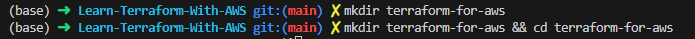

## A. Creating Resources and Terraform Fundamentals
Before crating some resources,  we need to define and configure providers in our ``providers.tf`` file.

````sh
terraform {
  required_providers {
    aws = {
      source  = "hashicorp/aws"
      version = "~> 5.0"
    }
  }
}

# Configure the AWS Provider
provider "aws" {
  region = "us-east-1"
}

````

Prior to terraform 0.12 you should use: 

````sh
# Configure the AWS Provider
provider "aws" {
  version = "~> 5.0"
  region  = "us-east-1"
}
````

After adding providers details, you have to initialize Terraform project by running ``terraform init`` 

 * ``terraform init``  will download providers plugins and will create a  ``.terraform`` folder in your workspace.

 * ``terraform init`` are not run very often , but **each time it is run, it will download the version of the specified provider**.

 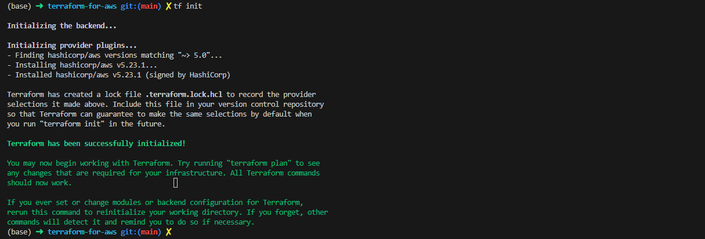

#### A.1 Create a VPC
For creating resource to our file.

````sh
resource "aws_vpc" "my_vpc" {
  cidr_block = "10.0.0.0/16"
  instance_tenancy = "default"

  tags = {
    Name        = "JavaHomeVpc"
    Environment = "Dev"
    Location    = "Paris - France"
  }
}
````

The structure of Terraform resource is:
* ``resource`` the key world
* The type of resource we are interest in ``"aws_vpc"``
* Logical name ``"my_vpc"``

Documentation:
* [Resource: aws_vpc](https://registry.terraform.io/providers/hashicorp/aws/latest/docs/resources/vpc)
* [Resource: Argument Reference](https://registry.terraform.io/providers/hashicorp/aws/latest/docs/resources/vpc#argument-reference) **are argument uses to define a vpc resource.**
* [Resource: Attribute Reference](https://registry.terraform.io/providers/hashicorp/aws/latest/docs/resources/vpc#attribute-reference) **are argument return after creating the vpc**

Now we can apply those changes by running ``terraform apply``.

``terraform apply`` execute:
* All scripts in the current folder
* It give us the plan detail and all actions that will be perform.

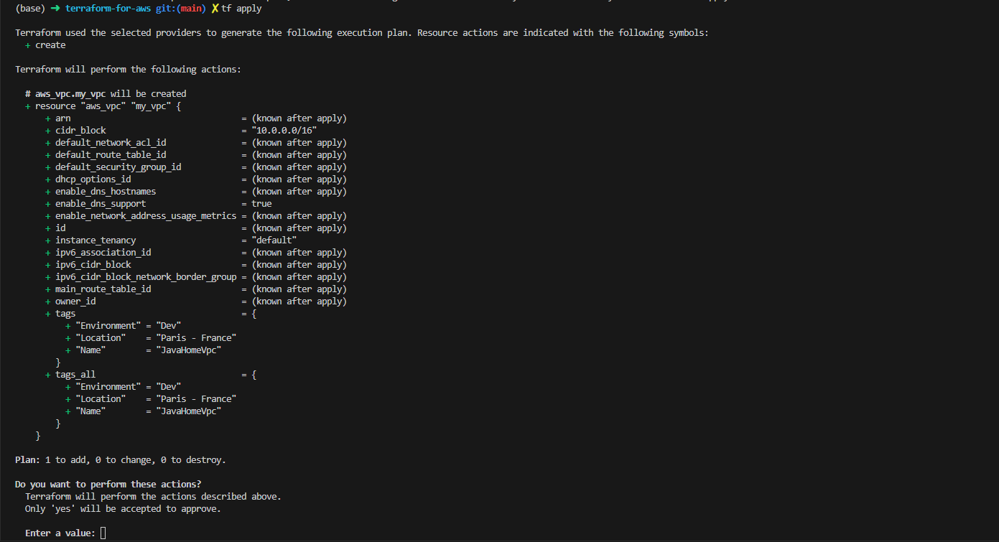
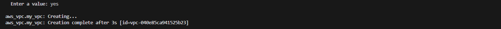

Finally our VPC is created

 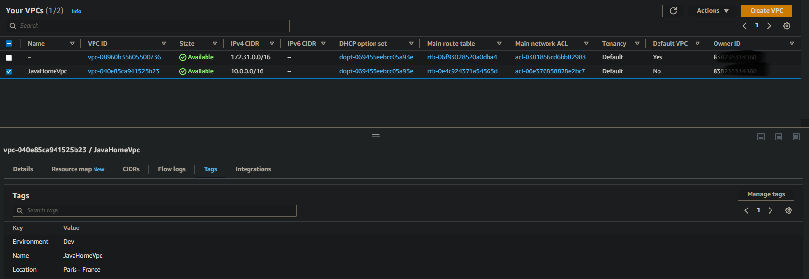

 **Note**:

 * If we run again ``terraform apply``, nothing will happens because resources has already been created.
 * Any change in the code(add more tags, change cidr block, etc...) will update our ressource.

##### A.1.1 Terraform Output
Suppose we want to print the ``cidr block`` after ``terraform apply`` is complete, we need to modify a bit our code by adding this piece of code:
````sh
output "vpc_cidr" {
    value = "${aws_vpc.my_vpc.cidr_block}"
}
````
 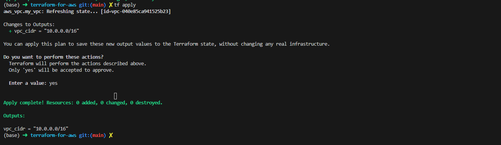

 #### A.2 Terraform Local State file
 All resources creates using Terraform script is maintain inside one JSON file format and called by default ``terraform.tfstate`` and the default location is your workspace.

 When you hint ``terraform apply`` , **it compare the terraform script with the state file**. 
 > Any difference between the files would allow terraform to add, update or destroy ressource in the state file**

 > If you delete your state file, **whatever resource he's create previously,  he's  loose connexion to that**. the ressource remain into your account but Terraform will not have access or control to tht ressource.

  #### A.3 Terraform Remote State file
  When many developers are working together on the same state file, it's very difficult to use a local state file. 
  * A good practice is to **use S3 as a remote state file location** and activate versioning on S3 bucket to keep previous version of the file.
  * It's also a good practice **to enable encryption**
 
  * [S3 Backend](https://developer.hashicorp.com/terraform/language/settings/backends/s3)

  By adding this piece of code, the problem will be solve.
````sh
  terraform {
  backend "s3" {
    bucket = "mybucket"
    key    = "path/to/my/key"
    region = "us-east-1"
  }
}
 ````

**Note::**

* After uploading your local state file to S3, you can delete the local file because terraform will not longer wse this local file, **it will only work with the remote file.

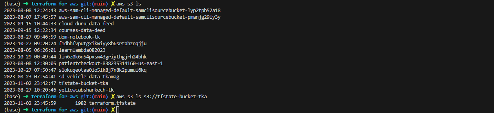

> That new file can be share securely between many developers.


#### A.4 Terraform Local State file
If multiple developers applying concurrently, it can create **inconsistent state file**
> **it's always important to make a lock when a developer is performing an operation on that** and block the remaining users until the current operation is completed.
>

For state locking and consistency, we use a ``dynamo_db`` table.
* [DynamoDB State Locking](https://developer.hashicorp.com/terraform/language/settings/backends/s3#dynamodb-state-locking)

* The table must have a partition key named **LockID** with type of String. If not configured, state locking will be disabled.

````sh
terraform {
  backend "s3" {
    bucket = "mybucket"
    key    = "path/to/my/key"
    region = "us-east-1"
    dynamodb_table = "table_name"
  }
}

````

Common errors

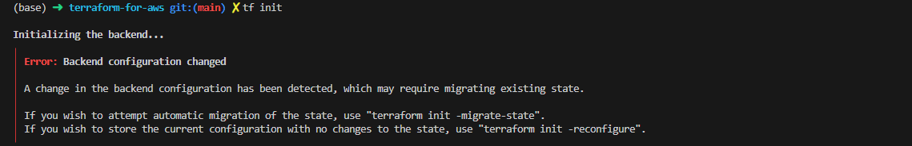

just run ``terraform init -migrate-state``


#### A.5 Terraform Variables And tfvars
In programmation, variables gives better maintainability and code reusability.
1. First create a new file called variables.tf
2. In terraform the name of the file don't matter, only the extensions of the file.
3. Don't forget to segregate you code into multiple small script.

**Note:**
* [Variables and Outputs](https://developer.hashicorp.com/terraform/language/values)

````==sh
variable "vpc_cidr" {
  default = "10.20.0.0/18"
  description ="Choose  cidr for VPC"
  type = "string"
}
````
* Here we have define a variable ``vpc_cidr`` with his default value, type and description. This value can be overwrite at the compilation using ``-var ``

* Now we need to change ``providers.tf`` a lite bit.


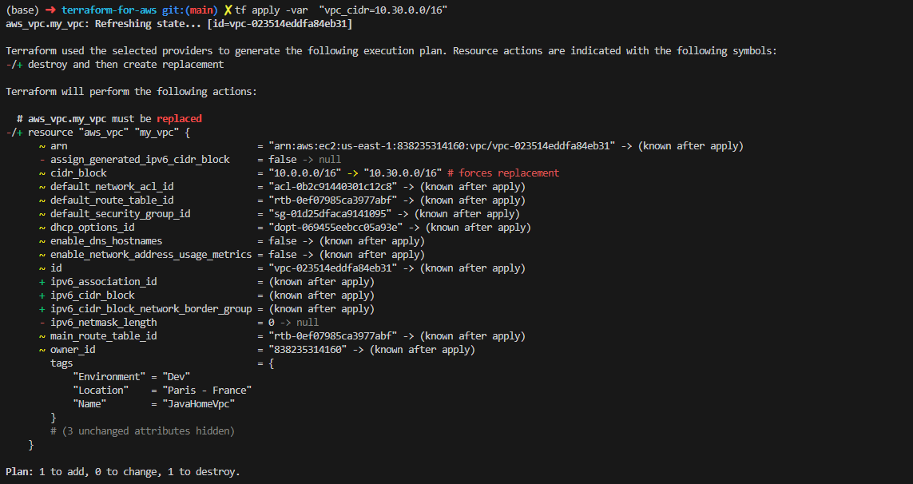
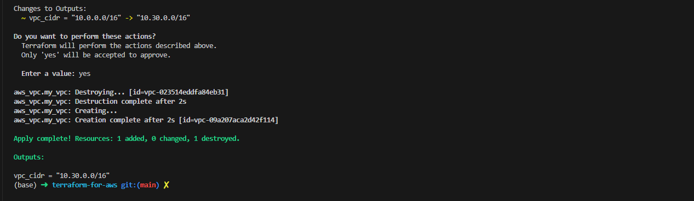

**Note:**
* You can use command line extension ``-auto-complete`` to avoid the prompt when using ``terraform apply``.
* To pass variables when using ``terraform apply``, use the command line ``-var "vpc_cidr=10.30.0.0/16"``
* When you have more than one variable, **keep those value inside a file** and pase the reference to that file using the comand line ``-var-file locatio_of_the_file``
* Whatever the name of the file you use, it is mandatory to have ``.tfvars`` as a file's extension.

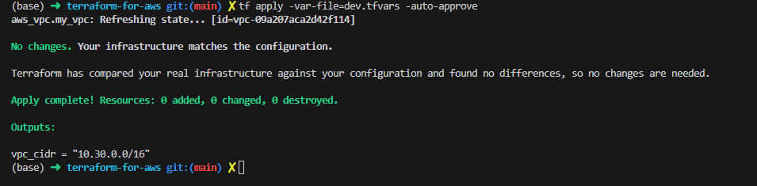

### A.6 Terraform Workspaces
Maintaining multiple environments is pretty handy. For developers we need too have Dev, Uat and Prod environments who have two different statements.

Terraform by default maintain ine workspace and created when initializing our project.
* Use ``terraform workspace list`` to list all workspaces
  
* Use ``terraform workspace new dev`` to create a new Dev workspace.
  > **Terraform maintain separate state file four all environment**.

* Use ``terraform workspace select dev`` to navigate between workspace.

When creating these workspaces, 
  > **Terraform will create as many folders in the bucket as environments you've decided to create**

  

  Resource ``aws_vpc`` has a key value **Environment** which is **Dev**, we can change it to make our script much more dynamic. So instead of:
  * ``Environment = "Dev"``, we'll have ``Environment = "${terraform.workspace}$``

### A.7 Terraform Loops
You can use loops for example when you want to create multiple same instance, the only thing you have to do is to mention the variable ``count`` inside your ressource.

````sh
resource "aws_vpc" "my_vpc" {
  count             = 3
  cidr_block        = "${var.vpc_cidr}"
  instance_tenancy  = "default"

  tags              = {
    Name            = "JavaHomeVpc"
    Environment     = "${terraform.workspace}"
    Location        = "Paris - France"
  }
}
````

### A.7 Terraform Conditions
In Terraform, we can create certains ressources conditionally i.e create a ressource in dev but not in production.

For example: 

We want to create 1 VPC in Prod and nothing in Dev. We can use this condition inside our vpc ressource:

``count = "${terraform.workspace == "dev"? 0, 1}"``

  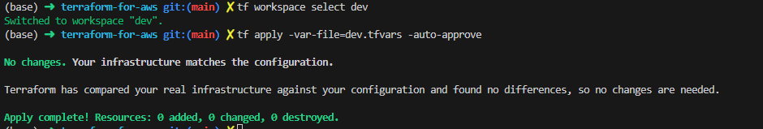

   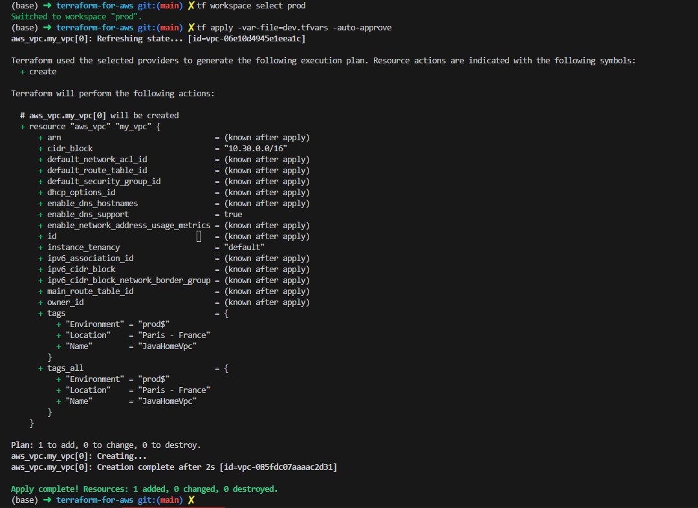

### A.8 Terraform Locals
If we have an expression with is repeatedly use in the code, we can declare them as part of the **local variables** and refer them in the code. So in the future, if you want to change the value, you don't have to change to value in the code but only where it's has been declared.

FOr this, let's create a separate file call ``locals.tf``
````sh
locals {
  vpc_name = "${terraform.workspace == "dev"? "javahome-dev", "javahome-prod"}"
}

resource "aws_vpc" "my_vpc" {
  count             = 3
  cidr_block        = "${var.vpc_cidr}"
  instance_tenancy  = "default"

  tags              = {
    Name            = "${local.vpc_name}"
    Environment     = "${terraform.workspace}"
    Location        = "Paris - France"
  }
}
````
**Note:** ``Local values`` are created by a ``locals block`` (plural), **but you reference them as attributes on an object named local (singular)**. Make sure to leave off the "s" when referencing a local value!

## B. Setting Up Networking For Our Applications