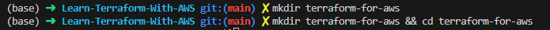
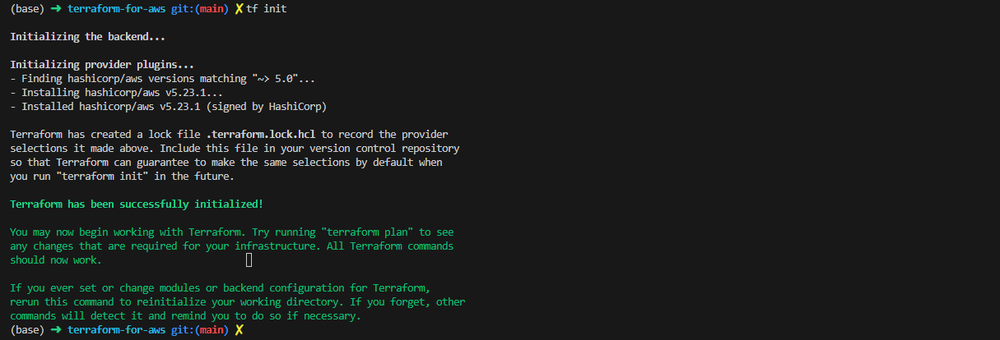

# Learn-Terraform-With-AWS

## Prerequisites

1. Update your ``.gitignore`` file by adding this:
````sh
# Local .terraform directories
**/.terraform/*

# .tfstate files
*.tfstate
*.tfstate.*

# Crash log files
crash.log
crash.*.log

# Exclude all .tfvars files, which are likely to contain sensitive data, such as
# password, private keys, and other secrets. These should not be part of version 
# control as they are data points which are potentially sensitive and subject 
# to change depending on the environment.
*.tfvars
*.tfvars.json
*.tfvars.example

# Ignore override files as they are usually used to override resources locally and so
# are not checked in
override.tf
override.tf.json
*_override.tf
*_override.tf.json

# Include override files you do wish to add to version control using negated pattern
# !example_override.tf

# Include tfplan files to ignore the plan output of command: terraform plan -out=tfplan
# example: *tfplan*

# Ignore CLI configuration files
.terraformrc
terraform.rc
````

3. **Create a folder** terraform-for-aws and **log in to that folder**.
````sh
mkdir terraform-for-aws && 
cd    terraform-for-aws
````


## A. Creating Resources and Terraform Fundamentals
Before crating some resources,  we need to define and configure providers in our ``main.tf`` file.

````sh
terraform {
  required_providers {
    aws = {
      source  = "hashicorp/aws"
      version = "~> 5.0"
    }
  }
}

# Configure the AWS Provider
provider "aws" {
  region = "us-east-1"
}

````

Prior to terraform 0.12 you should use: 

````sh
# Configure the AWS Provider
provider "aws" {
  version = "~> 5.0"
  region  = "us-east-1"
}
````

After adding providers details, you have to initialize Terraform project by running ``terraform init`` 

 ``terraform init``  will download providers plugins and will create a  ``.terraform`` folder in your workspace.

 

#### A.1 Create a VPC
Before creating
